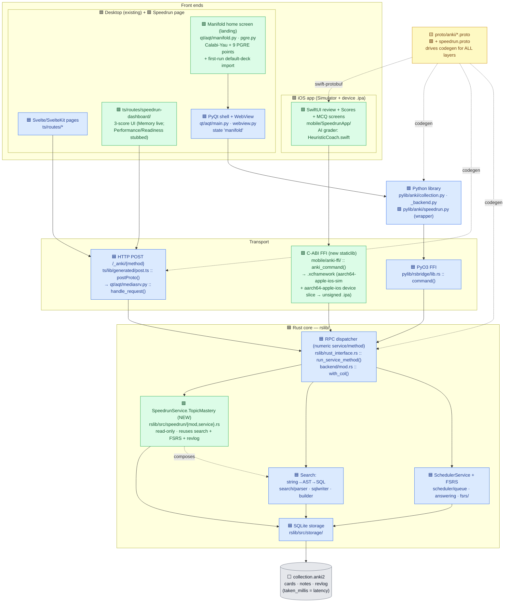
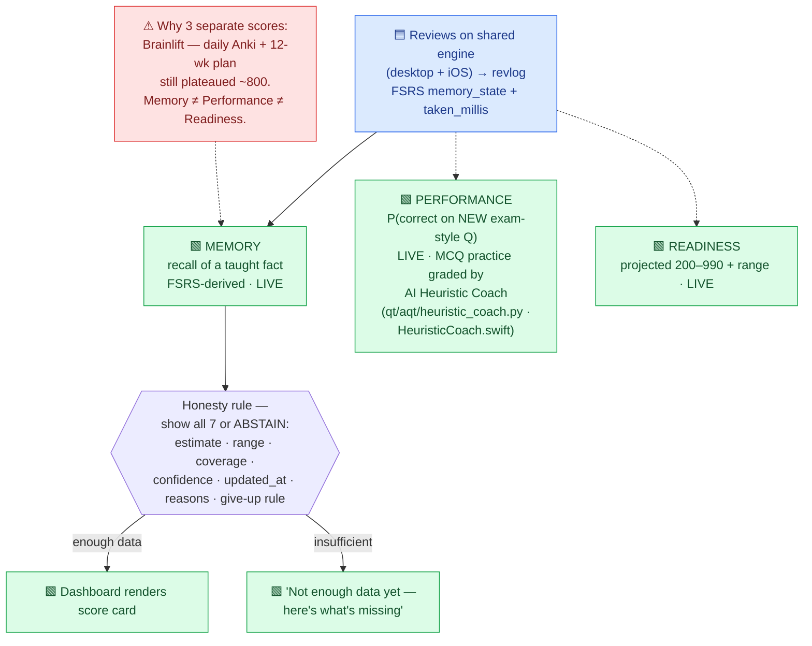
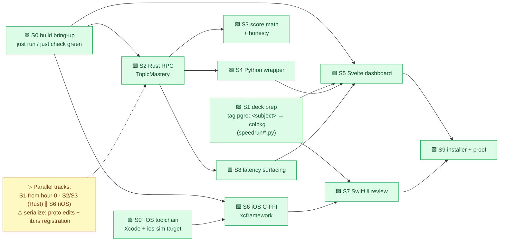
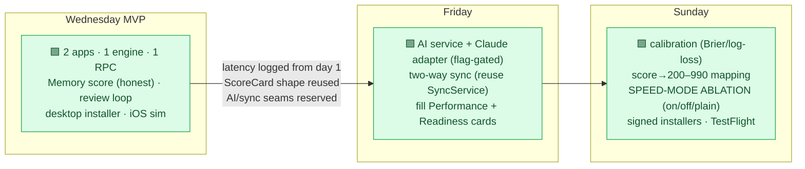

# Speedrun PGRE — System Architecture (visual)

A single visual synthesis of all the docs: the existing **Anki** engine
([CODE_MAP.md](CODE_MAP.md), [docs/tech-stack.md](docs/tech-stack.md),
[docs/data-flow.md](docs/data-flow.md), [docs/rust-core.md](docs/rust-core.md))
plus the planned **Speedrun** fork ([PRD.md](PRD.md), [SPECS.md](SPECS.md),
[speedrun/README.md](speedrun/README.md)).

> CODE_MAP.md is the canonical file→function locator. This doc is the
> bird's-eye view that stitches the architecture, data flow, and the Speedrun
> MVP plan into one picture.

**Legend** — 🟦 existing Anki · 🟩 NEW (Speedrun, planned) · 🟨 generated/build ·
⬜ data store.

---

## 1. The whole system — one engine, two apps, one new RPC

**Reading it:** both apps speak the _same_ protobuf to the _same_ Rust engine —
desktop through PyO3/HTTP, iOS through a new tiny C-ABI. The only engine change is
one **read-only** RPC (`TopicMastery`) that composes existing search + FSRS +
revlog primitives, so undo and DB integrity are untouched (the spec's key claim).

**Desktop landing screen:** the fork opens on a **Calabi-Yau manifold home
screen** ([qt/aqt/manifold.py](qt/aqt/manifold.py), HTML from
[qt/aqt/pgre.py](qt/aqt/pgre.py) `build_manifold_html`) instead of the deck list
— a new `"manifold"` `MainWindowState` in [qt/aqt/main.py](qt/aqt/main.py). Its
9 outer points open the PGRE decks' Study Now overview; a "Classic deck list"
link falls back to the intact `DeckBrowser`. On a fresh collection, first launch
auto-imports the 9 bundled `categorized decks/` `.apkg` files into
`PGRE::<Subject>` decks (`_seed_default_decks` → `import_default_decks`, guarded
by `pgreDefaultDecksImported`).

---

## 2. The one real Rust change — `TopicMastery` end-to-end

```mermaid
flowchart LR
    subgraph IN["Callers (same RPC, 3 hosts)"]
        TS["🟩 dashboard<br/>@generated/backend"]
        PY["🟩 col.speedrun / _backend.topic_mastery()"]
        SW["🟩 (iOS, later) anki_command()"]
    end

    TS --> POST["🟦 postProto → mediasrv"]
    PY --> RB["🟦 rsbridge.command()"]
    SW --> FF["🟩 anki_command()"]
    POST --> DISP
    RB --> DISP
    FF --> DISP

    DISP["🟦 run_service_method(service,method,bytes)<br/>with_col() acquires collection"]
    DISP --> IMPL["🟩 speedrun/service.rs :: topic_mastery()"]

    subgraph LOGIC["🟩 speedrun/mod.rs — single scan, O(C+R)"]
        Q1["1. scan cards⋈notes<br/>map tag pgre::&lt;subject&gt; → [SubjectAccum; 9]"]
        Q2["2. per card R =<br/>current_retrievability_seconds(state, secs, decay)<br/>(FSRS::new hoisted out of loop)"]
        Q3["3. scan revlog⋈cards<br/>median taken_millis via select_nth_unstable"]
        Q4["4. coverage = Σ weight(subject ≥1 card)<br/>memory_score = coverage-weighted mean R<br/>Wilson range · confidence · reasons"]
        Q5{"give-up rule?<br/>reviews&lt;100 ∨ coverage&lt;40%<br/>∨ a ≥10% subject has 0 cards"}
    end

    IMPL --> Q1 --> Q2 --> Q3 --> Q4 --> Q5
    Q5 -->|yes| AB["abstain = true<br/>(no bare number)"]
    Q5 -->|no| SC["ScoreCard{estimate, low, high,<br/>coverage, confidence, updated_at, reasons[]}"]

    REUSE["🟦 reused primitives:<br/>search_cards · Card.memory_state<br/>FsrsMemoryState · revlog.taken_millis<br/>browser_table retrievability pattern"]
    REUSE -.-> LOGIC

    classDef existing fill:#dbeafe,stroke:#2563eb,color:#1e3a8a;
    classDef new fill:#dcfce7,stroke:#16a34a,color:#14532d;
    class POST,RB,DISP,REUSE existing;
    class TS,PY,SW,FF,IMPL,Q1,Q2,Q3,Q4,Q5,AB,SC new;
```

---

## 3. The three scores & the honesty rule (product core)

---

## 4. Wednesday MVP build plan (SPECS S0–S9 dependency graph)

---

## 5. How later deadlines slot in (additive, no rework)

---

## Quick map: doc → what it answers

| Question                                   | Doc                                                                                                                                          |
| ------------------------------------------ | -------------------------------------------------------------------------------------------------------------------------------------------- |
| Where is feature X's file+function?        | [CODE_MAP.md](CODE_MAP.md)                                                                                                                   |
| What is each technology / crate?           | [docs/tech-stack.md](docs/tech-stack.md)                                                                                                     |
| What happens to one RPC at runtime?        | [docs/data-flow.md](docs/data-flow.md)                                                                                                       |
| How is `rslib` organized?                  | [docs/rust-core.md](docs/rust-core.md)                                                                                                       |
| Desktop UI: manifold home + default decks? | [CODE_MAP.md](CODE_MAP.md) (Diagram 6), [docs/data-flow.md](docs/data-flow.md), [categorized decks/README.md](categorized%20decks/README.md) |
| Why these product choices?                 | [PRD.md](PRD.md)                                                                                                                             |
| What exactly to build + test thresholds?   | [SPECS.md](SPECS.md)                                                                                                                         |
| Deck-prep / fixture tooling?               | [speedrun/README.md](speedrun/README.md)                                                                                                     |
