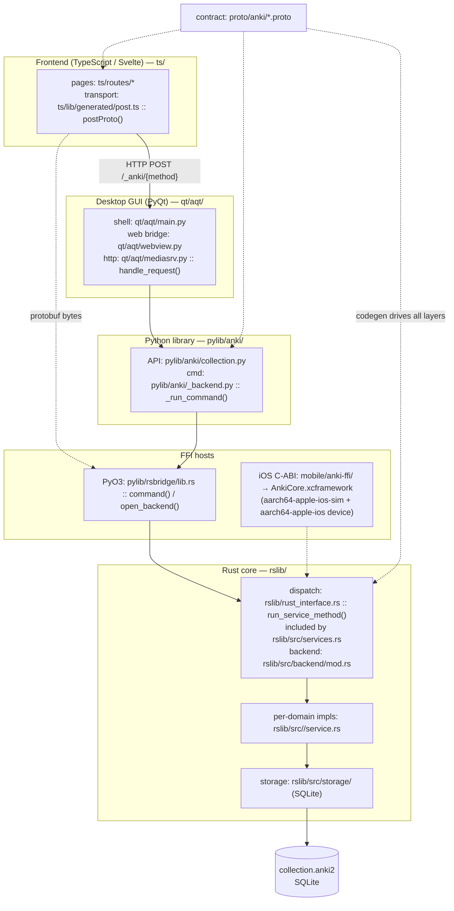
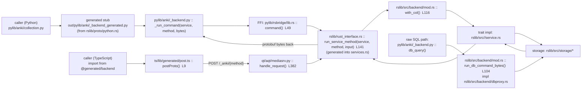
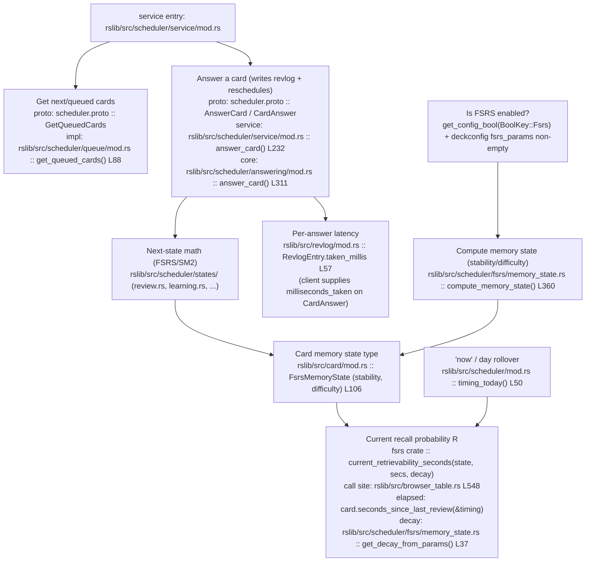
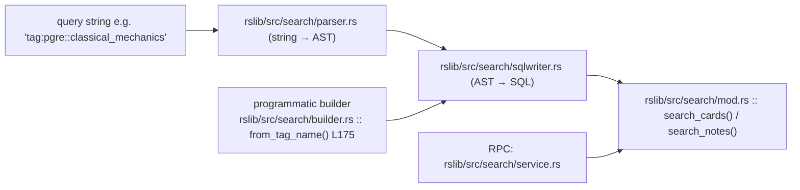
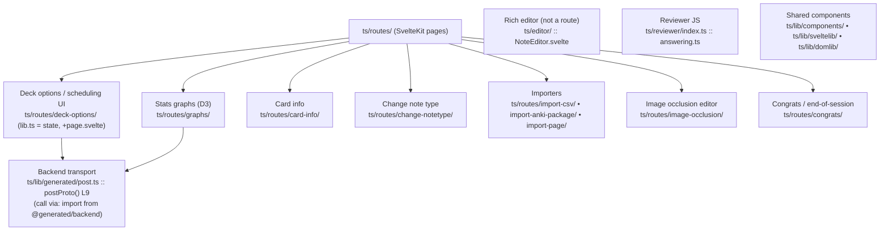
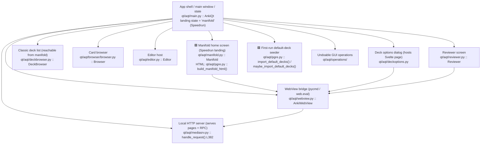
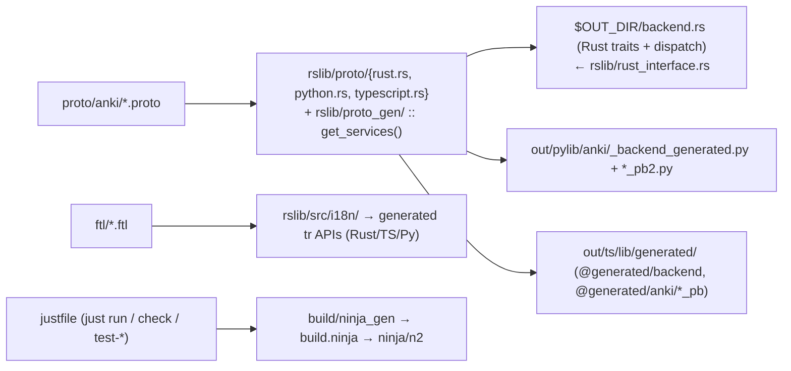
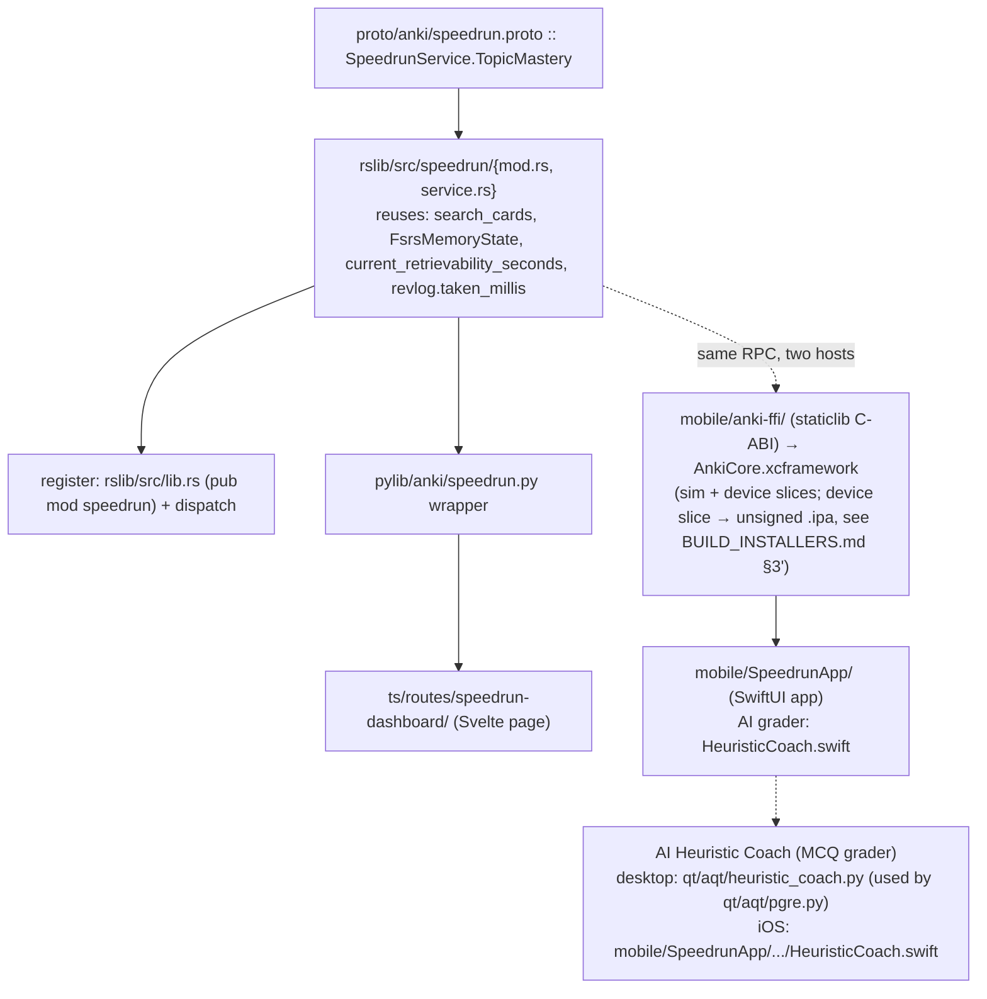

# Anki Code Map (navigation diagrams)

Purpose: let an agent locate the **exact file + function** for a feature without
reading the tree. Every node is labeled `role` + `path :: symbol`. Line numbers
(where shown) were verified at time of writing but **drift** — the _function/type
name is the stable anchor_; grep for it if the line is off.

See also: [docs/architecture.md](docs/architecture.md),
[docs/data-flow.md](docs/data-flow.md), [docs/rust-core.md](docs/rust-core.md).

---

## 0. Layer overview — where each language lives



---

## 1. Cross-language request flow (follow one RPC end-to-end)



---

## 2. rslib subsystem locator (the main "where is feature X?" map)

```mermaid
flowchart TD
    LIB["rslib/src/lib.rs (module roots)"]

    LIB --> COL["Collection state / open / undo / backup<br/>rslib/src/collection/mod.rs :: Collection, CollectionBuilder<br/>open RPC: rslib/src/backend/collection.rs :: open_collection() L17"]
    LIB --> STOR["SQLite storage (per-entity submodules)<br/>rslib/src/storage/ (card/ note/ deck/ revlog/ ...)<br/>migrations: rslib/src/storage/upgrades/ • integrity: rslib/src/dbcheck.rs"]
    LIB --> SCH["Scheduler + FSRS (see Diagram 3)<br/>rslib/src/scheduler/"]
    LIB --> SR["Search: string→AST→SQL (see Diagram 4)<br/>rslib/src/search/"]
    LIB --> CARD["Cards CRUD<br/>rslib/src/card/mod.rs :: Card, FsrsMemoryState (L106)<br/>rslib/src/card/service.rs"]
    LIB --> NOTE["Notes CRUD + tags-on-note<br/>rslib/src/notes/mod.rs :: Note.tags"]
    LIB --> NT["Note types / templates schema<br/>rslib/src/notetype/"]
    LIB --> DECK["Decks + tree + limits<br/>rslib/src/decks/ (tree.rs, limits.rs, name.rs)"]
    LIB --> DC["Deck config (FSRS params, retention)<br/>rslib/src/deckconfig/mod.rs :: fsrs_params() L112"]
    LIB --> REND["Card rendering pipeline<br/>rslib/src/template.rs • template_filters.rs • cloze.rs<br/>rslib/src/card_rendering/ (parser.rs, writer.rs)"]
    LIB --> IE["Import / Export<br/>rslib/src/import_export/package/ (.apkg/.colpkg)<br/>rslib/src/import_export/text/ (CSV)"]
    LIB --> MED["Media files + check + sync<br/>rslib/src/media/ (files.rs, check.rs)"]
    LIB --> SYNC["Sync (collection + media)<br/>rslib/src/sync/collection/ • media/ • http_client/ • http_server/"]
    LIB --> TAGS["Tags hierarchy<br/>rslib/src/tags/ • service.rs :: all_tags()"]
    LIB --> STATS["Stats / graphs data<br/>rslib/src/stats/"]
    LIB --> REV["Review log (answer latency!)<br/>rslib/src/revlog/mod.rs :: RevlogEntry.taken_millis (L57)"]
    LIB --> OPS["Operations + undo model<br/>rslib/src/ops.rs :: Op, OpChanges, StateChanges<br/>rslib/src/undo/ :: UndoManager"]
    LIB --> ERR["Errors<br/>rslib/src/error/mod.rs :: AnkiError<br/>→proto: rslib/src/backend/error.rs :: into_protobuf() L11"]
    LIB --> I18N["i18n (Fluent), generated from ftl/<br/>rslib/src/i18n/"]
    LIB --> BR["Browser table (retrievability display)<br/>rslib/src/browser_table.rs :: current_retrievability_seconds() L548"]
    LIB --> IO["Image occlusion<br/>rslib/src/image_occlusion/"]
```



---

## 3. Scheduler, FSRS & latency (most relevant to Speedrun)



---

## 4. Search pipeline (string → results)



---

## 5. Frontend (TypeScript / Svelte) — page locator



---

## 6. Qt desktop GUI — component locator



The Speedrun fork replaces the deck list as the landing screen with a
**Calabi-Yau manifold home screen** ([qt/aqt/manifold.py](qt/aqt/manifold.py),
modeled on `qt/aqt/deckbrowser.py`). `AnkiQt` gains a `"manifold"`
`MainWindowState` plus `setupManifold()` / `_manifoldState()`, and
`loadCollection` calls `moveToState("manifold")`. The screen renders
`qt/aqt/data/web/imgs/calabi-yau.jpg` with a button at each of the manifold's 10
outer points: the first 9 are the PGRE subjects (clicking runs
`pycmd('open:<deckId>')` → the deck's "Study Now" overview), the 10th is a
"Coming soon" placeholder, and a "Classic deck list" link (`pycmd('classic')`)
opens the intact `DeckBrowser`. The toolbar "Decks" link, the `d` shortcut, the
overview "Decks" back-link, and the reviewer "Finish" action all return to
`"manifold"`. On first launch of a fresh collection, `_seed_default_decks`
auto-imports the 9 bundled PGRE decks (see Diagram 7 / the taxonomy note).

---

## 7. Build & generated code (where the missing files come from)



---

## 8. Speedrun additions — where the fork's code lives (shipped)

From [PRD.md](PRD.md) / [SPECS.md](SPECS.md). These files now **exist** (the
diagram originally listed them as planned target locations).



---

## 9. Feature → file/function index (fallback lookup)

| Feature                            | File :: symbol                                                                                                                                                                                           |
| ---------------------------------- | -------------------------------------------------------------------------------------------------------------------------------------------------------------------------------------------------------- |
| RPC dispatch (service,method→impl) | `rslib/rust_interface.rs :: run_service_method` (gen → `rslib/src/services.rs`)                                                                                                                          |
| Backend init / collection lock     | `rslib/src/backend/mod.rs :: init_backend` (L69), `with_col` (L116)                                                                                                                                      |
| Raw SQL proxy                      | `rslib/src/backend/mod.rs :: run_db_command_bytes` (L104) → `backend/dbproxy.rs`                                                                                                                         |
| Open a collection                  | `rslib/src/backend/collection.rs :: open_collection` (L17)                                                                                                                                               |
| Python→Rust FFI                    | `pylib/rsbridge/lib.rs :: command` (L49) / `open_backend` (L40)                                                                                                                                          |
| Python command entry               | `pylib/anki/_backend.py :: _run_command` (L159)                                                                                                                                                          |
| TS→Rust transport                  | `ts/lib/generated/post.ts :: postProto` (L9) → `qt/aqt/mediasrv.py :: handle_request` (L382)                                                                                                             |
| Get next cards to review           | `rslib/src/scheduler/queue/mod.rs :: get_queued_cards` (L88)                                                                                                                                             |
| Answer a card                      | `rslib/src/scheduler/answering/mod.rs :: answer_card` (L311); service `scheduler/service/mod.rs :: answer_card` (L232)                                                                                   |
| Answer latency (speed signal)      | `rslib/src/revlog/mod.rs :: RevlogEntry.taken_millis` (L57)                                                                                                                                              |
| FSRS memory state (type)           | `rslib/src/card/mod.rs :: FsrsMemoryState` (L106)                                                                                                                                                        |
| Compute memory state               | `rslib/src/scheduler/fsrs/memory_state.rs :: compute_memory_state` (L360)                                                                                                                                |
| Current recall probability R       | `fsrs` crate `current_retrievability_seconds`; call site `rslib/src/browser_table.rs` (L548)                                                                                                             |
| FSRS decay selection               | `rslib/src/scheduler/fsrs/memory_state.rs :: get_decay_from_params` (L37)                                                                                                                                |
| Deck FSRS params / retention       | `rslib/src/deckconfig/mod.rs :: fsrs_params` (L112)                                                                                                                                                      |
| Tag search builder                 | `rslib/src/search/builder.rs :: from_tag_name` (L175)                                                                                                                                                    |
| Search parse / SQL                 | `rslib/src/search/parser.rs`, `sqlwriter.rs`, run via `search/mod.rs :: search_cards`                                                                                                                    |
| Note tags storage                  | `rslib/src/notes/mod.rs :: Note.tags`; all tags `rslib/src/tags/service.rs :: all_tags`                                                                                                                  |
| Undo / change tracking             | `rslib/src/ops.rs :: Op/OpChanges/StateChanges`; `rslib/src/undo/ :: UndoManager`                                                                                                                        |
| Error → protobuf                   | `rslib/src/backend/error.rs :: into_protobuf` (L11); `rslib/src/error/mod.rs :: AnkiError`                                                                                                               |
| "now" / day rollover               | `rslib/src/scheduler/mod.rs :: timing_today` (L50)                                                                                                                                                       |
| Card render / templates            | `rslib/src/template.rs`, `cloze.rs`, `card_rendering/`                                                                                                                                                   |
| Import/export (.apkg/CSV)          | `rslib/src/import_export/package/`, `import_export/text/`                                                                                                                                                |
| Sync (collection/media)            | `rslib/src/sync/{collection,media,http_client,http_server}/`                                                                                                                                             |
| Reviewer UI (desktop)              | `qt/aqt/reviewer.py :: Reviewer`; web `ts/reviewer/index.ts`                                                                                                                                             |
| Manifold home screen (Speedrun)    | `qt/aqt/manifold.py :: Manifold`; HTML `qt/aqt/pgre.py :: build_manifold_html`; state `qt/aqt/main.py :: "manifold"` (`setupManifold`/`_manifoldState`)                                                  |
| AI Heuristic Coach (MCQ grader)    | desktop `qt/aqt/heuristic_coach.py` (used by `qt/aqt/pgre.py`); iOS `mobile/SpeedrunApp/Sources/HeuristicCoach.swift`                                                                                    |
| iOS C-FFI / xcframework / device   | `mobile/anki-ffi/` → `mobile/AnkiCore.xcframework` (sim + `aarch64-apple-ios` device); unsigned `.ipa` per `BUILD_INSTALLERS.md` §3'                                                                     |
| First-run default-deck import      | `qt/aqt/pgre.py :: import_default_decks`/`maybe_import_default_decks` (flag `pgreDefaultDecksImported`); `qt/aqt/main.py :: _seed_default_decks`; build rule `build/configure/src/aqt.rs :: build_decks` |
| Test helpers (Rust)                | `rslib/src/tests.rs :: NoteAdder, CardAdder`; `Collection::new()`                                                                                                                                        |
| Test helpers (Python)              | `pylib/tests/shared.py :: getEmptyCol`; review via `col.sched.answerCard(card, ease)`                                                                                                                    |

```
```
